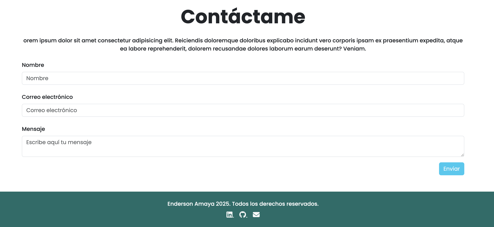
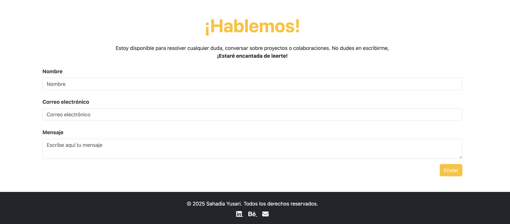

# Contribución para el desafío de portafolio

Este proyecto incluye contribuciones realizadas en dos forks diferentes:

1. [Fork del repositorio de Enderson Amaya](https://github.com/Enderson93/Enderson93.github.io)
2. [Fork del repositorio de Sahadia88](https://github.com/Sahadia88/prueba1-ADL)

## Mejoras realizadas

### 1. Agregado de redes sociales al footer (Fork de Enderson Amaya)

Se agregó una sección de **redes sociales** en el footer del archivo `index.html`. Los enlaces agregados son:

- [LinkedIn](enlace-a-tu-linkedin)
- [GitHub](enlace-a-tu-github)
- Correo electrónico: [tuemail@dominio.com](mailto:tuemail@dominio.com)

Esto permite una mejor conexión profesional y visibilidad del perfil.

**Captura del cambio:**

---

### 2. Estilo visual mejorado del footer (Fork de Sahadia88)

Se rediseñó el **footer** para darle un aspecto más moderno y profesional. Los cambios incluyen:

- Fondo oscuro (`bg-dark`) y texto blanco.
- Íconos sociales con Font Awesome.
- Contenido centrado con mejor uso del espacio.

**Captura del cambio:**

## Enlaces útiles

- [Repositorio de Enderson forkeado](https://github.com/IanMtnez/Enderson93.github.io)
- [Repositorio de Sahadia forkeado](https://github.com/IanMtnez/prueba1-ADL)
- [Mi GitHub Pages](https://IanMtnez.github.io)
